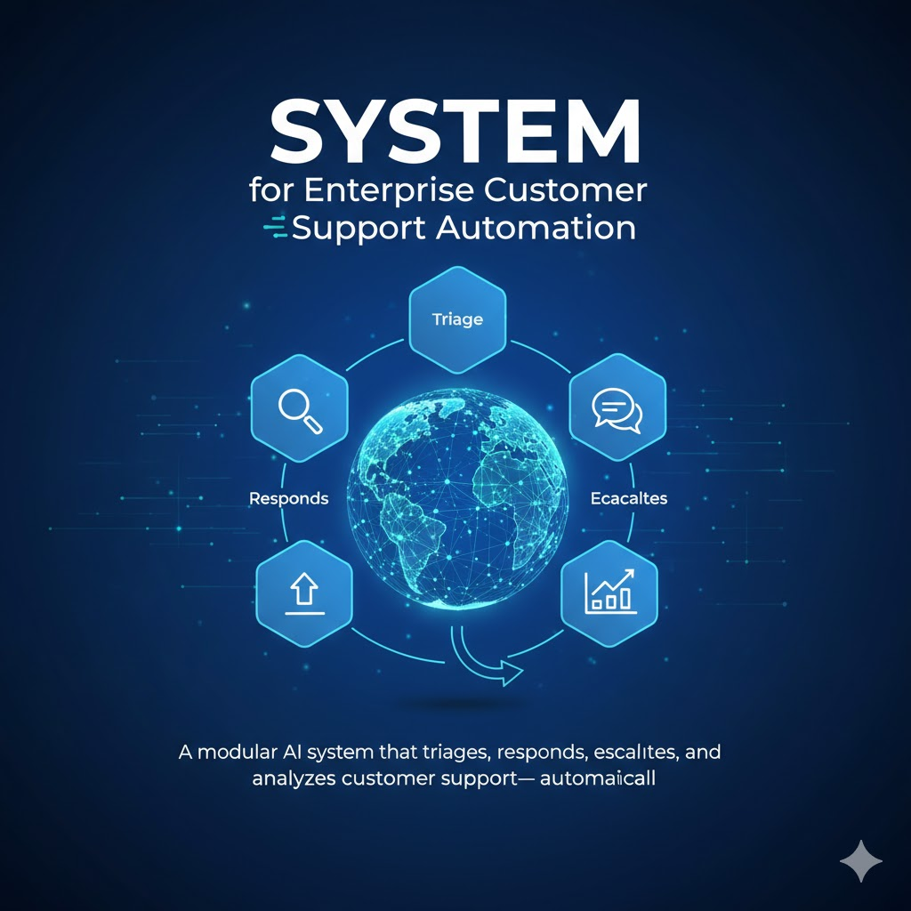

# SupportHub AI - Enterprise Customer Support & Operations Intelligence Agent

> **Track:** Enterprise Agents  
> **Author:** Akarashak Mishra  
> **Submission:** Kaggle Agents Intensive - Capstone Project

---

# Project Overview – SupportHub AI

> **NOTE:** This is a sample submission for the [Kaggle Agents Intensive Capstone project](https://www.kaggle.com/competitions/agents-intensive-course-capstone-2025/). Use this as a structuring reference for your submission. Inspired by multi-agent samples like [ADK-Samples](https://github.com/google/adk-samples). Special thanks to the community contributors.

---

## Problem Statement

Enterprise customer support suffers from:
- **Data silos:** Info scattered across CRM, email, tickets, chat.
- **Manual work:** Agents spend up to 40% of time on repetitive triage/routing/tasks.
- **Slow responses:** Customers may wait 8+ hours for first contact.
- **Variable quality:** Support is inconsistent due to experience gaps.
- **Scaling issues:** Adding headcount is expensive as demand grows.

Manual processes can’t scale, maintain quality, or deliver efficiency in modern enterprises.

---

## Solution Statement

**SupportHub AI** is a modular, fully-automated multi-agent system that:
- Instantly triages, categorizes, and prioritizes support tickets.
- Aggregates all relevant information (CRM, prior tickets, KB) for every customer.
- Crafts, checks, and refines professional support responses using AI.
- Escalates challenging issues autonomously.
- Provides dashboards for management on SLAs, sentiment, volume trends, and outcomes.

Agents operate autonomously or in coordinated workflows, streamlining operations and reducing human effort.

---

## Architecture

Core to SupportHub AI is the `support_hub_coordinator`, an example of multi-agent orchestration.
flowchart LR
A[SupportHub Coordinator] --> B[Triage Agent]
B --> C[Context Aggregator Agent]
C --> D[Response Generator Agent]
D --> E[Escalation Agent]
E --> F[Analytics Agent]
C --> G[CRM Tool]
C --> H[KB Tool]
C --> I[Ticket History Tool]

graph TB
    A[Customer Ticket Input] --> B[Support Hub Coordinator]
    
    B --> C[Triage Agent]
    B --> D[Context Aggregator]
    B --> E[Response Generator]
    B --> F[Escalation Agent]
    B --> G[Analytics Agent]
    
    C --> C1[Category Classification]
    C --> C2[Priority Detection]
    C --> C3[Sentiment Analysis]
    
    D --> D1[CRM Lookup Tool]
    D --> D2[Ticket History Tool]
    D --> D3[Knowledge Base Tool]
    
    D1 & D2 & D3 --> D4[Parallel Execution]
    
    E --> E1[Draft Response]
    E1 --> E2[Validate Quality]
    E2 --> E3{Quality Check Pass?}
    E3 -->|No| E1
    E3 -->|Yes| E4[Final Response]
    
    F --> F1{Escalation Needed?}
    F1 -->|Yes| F2[Route to Specialist]
    F1 -->|No| F3[Continue Workflow]
    
    G --> G1[SLA Monitoring]
    G --> G2[Trend Analysis]
    G --> G3[Performance Metrics]
    
    E4 --> H[Customer Response]
    F2 --> I[Human Agent]
    G1 & G2 & G3 --> J[Analytics Dashboard]
    
    style B fill:#4285f4,stroke:#333,stroke-width:3px,color:#fff
    style C fill:#34a853,stroke:#333,stroke-width:2px,color:#fff
    style D fill:#fbbc04,stroke:#333,stroke-width:2px,color:#fff
    style E fill:#ea4335,stroke:#333,stroke-width:2px,color:#fff
    style F fill:#9334e6,stroke:#333,stroke-width:2px,color:#fff
    style G fill:#ff6d00,stroke:#333,stroke-width:2px,color:#fff

- **Triage Agent:** Categorizes, prioritizes, and detects sentiment.
- **Context Aggregator:** Fetches CRM info, past tickets, and knowledge base data in parallel.
- **Response Generator:** Drafts and validates responses.
- **Escalation Agent:** Routes urgent/complex cases to human or specialist agents.
- **Analytics Agent:** Tracks trends, performance, and SLA compliance.

---

## Essential Tools and Utilities

- **CRM Lookup:** Finds customer account/tier/history.
- **Ticket History:** Retrieves all previous support contacts.
- **Knowledge Base Search:** Supplies policy/FAQ/solution links.
- **SLA Checker:** Ensures deadlines are tracked/met.
- **Notification:** Sends alerts or escalates issues as needed.
- **Memory:** Remembers resolved patterns, urgent cases, and context.

---

## Workflow

flowchart TD
    Start([Ticket Received]) --> Triage[🔍 Triage Agent]
    
    Triage --> T1{Analyze Ticket}
    T1 --> T2[Determine Category]
    T2 --> T3[Assess Priority]
    T3 --> T4[Detect Sentiment]
    T4 --> T5[Calculate Complexity]
    
    T5 --> Context[📊 Context Aggregator]
    
    Context --> P1[Parallel Execution Starts]
    P1 --> CRM[Fetch CRM Data]
    P1 --> History[Fetch Ticket History]
    P1 --> KB[Search Knowledge Base]
    
    CRM & History & KB --> P2[Aggregate All Context]
    
    P2 --> Response[✍️ Response Generator]
    
    Response --> R1[Generate Draft]
    R1 --> R2[Validate Response]
    R2 --> R3{Quality Check}
    R3 -->|Failed| R1
    R3 -->|Passed| R4[Finalize Response]
    
    R4 --> Escalation[🚨 Escalation Agent]
    
    Escalation --> E1{Check Escalation Rules}
    E1 -->|High Priority| E2[Escalate to Specialist]
    E1 -->|VIP Customer| E3[Escalate to Senior Agent]
    E1 -->|Complex Issue| E4[Escalate to Tech Team]
    E1 -->|Normal| E5[Send Response]
    
    E2 & E3 & E4 --> Human[👤 Human Agent]
    E5 --> Customer([📧 Customer Receives Response])
    
    E5 --> Analytics[📈 Analytics Agent]
    Human --> Analytics
    
    Analytics --> A1[Update SLA Status]
    Analytics --> A2[Log Sentiment Trend]
    Analytics --> A3[Track Category Distribution]
    Analytics --> A4[Calculate Performance Metrics]
    
    A1 & A2 & A3 & A4 --> Dashboard[📊 Management Dashboard]
    
    Dashboard --> End([Process Complete])
    
    style Start fill:#4285f4,stroke:#333,stroke-width:2px,color:#fff
    style Triage fill:#34a853,stroke:#333,stroke-width:2px,color:#fff
    style Context fill:#fbbc04,stroke:#333,stroke-width:2px,color:#fff
    style Response fill:#ea4335,stroke:#333,stroke-width:2px,color:#fff
    style Escalation fill:#9334e6,stroke:#333,stroke-width:2px,color:#fff
    style Analytics fill:#ff6d00,stroke:#333,stroke-width:2px,color:#fff
    style End fill:#4285f4,stroke:#333,stroke-width:2px,color:#fff

---

## Value Statement

SupportHub AI delivers:
- 80% reduction in first response time (8h → 1h)
- Handles 2x tickets per agent, automating all repetitive triage and lookup
- Consistent, on-brand support quality for customers
- $500k+ projected annual savings at scale for mid-large enterprises
- Analytics for proactive process improvement

_With additional resources: can be extended for multilingual support, self-service automation, or advanced predictive analytics._

---

graph LR
    subgraph Input
        A[Ticket Data]
        B[Customer Email]
        C[Subject Line]
        D[Description]
    end
    
    subgraph Triage Processing
        E[Category: billing/tech/account]
        F[Priority: high/medium/low]
        G[Sentiment: positive/neutral/negative]
        H[Complexity Score: 0-1]
    end
    
    subgraph Context Sources
        I[(CRM Database)]
        J[(Ticket History)]
        K[(Knowledge Base)]
    end
    
    subgraph Aggregated Context
        L[Customer Tier]
        M[Purchase History]
        N[Previous Issues]
        O[Resolution History]
        P[Relevant KB Articles]
    end
    
    subgraph Response Generation
        Q[Draft Response v1]
        R[Quality Validation]
        S[Draft Response v2]
        T[Final Response]
    end
    
    subgraph Escalation Logic
        U{Escalation Check}
        V[Human Agent Queue]
        W[Customer Delivery]
    end
    
    subgraph Analytics Output
        X[SLA Status]
        Y[Sentiment Trends]
        Z[Category Distribution]
        AA[Performance Metrics]
    end
    
    A & B & C & D --> E & F & G & H
    E & F & G & H --> I & J & K
    I --> L & M
    J --> N & O
    K --> P
    L & M & N & O & P --> Q
    Q --> R
    R --> S
    S --> T
    T --> U
    U -->|Yes| V
    U -->|No| W
    T --> X & Y & Z & AA
    
    style E fill:#34a853,stroke:#333,color:#fff
    style F fill:#34a853,stroke:#333,color:#fff
    style G fill:#34a853,stroke:#333,color:#fff
    style H fill:#34a853,stroke:#333,color:#fff
    style I fill:#fbbc04,stroke:#333,color:#fff
    style J fill:#fbbc04,stroke:#333,color:#fff
    style K fill:#fbbc04,stroke:#333,color:#fff
    style T fill:#ea4335,stroke:#333,color:#fff
---
graph TD
    subgraph Coordinator Layer
        A[Support Hub Coordinator Main Orchestrator]
    end
    
    subgraph Agent Layer
        B[Triage Agent Sequential Processing]
        C[Context Aggregator Parallel Agent]
        D[Response Generator Loop Agent]
        E[Escalation Agent Decision Agent]
        F[Analytics Agent Sequential Pipeline]
    end
    
    subgraph Tool Layer
        G[CRM Lookup Tool]
        H[Ticket History Tool]
        I[Knowledge Base Tool]
        J[Notification Tool]
        K[SLA Tracker Tool]
    end
    
    subgraph External Systems
        L[(CRM System)]
        M[(Ticketing DB)]
        N[(Knowledge Base)]
        O[Email/Slack]
        P[Analytics Dashboard]
    end
    
    A --> B
    A --> C
    A --> D
    A --> E
    A --> F
    
    C --> G
    C --> H
    C --> I
    
    E --> J
    F --> K
    
    G --> L
    H --> M
    I --> N
    J --> O
    K --> P
    
    style A fill:#4285f4,stroke:#333,stroke-width:3px,color:#fff
    style B fill:#34a853,stroke:#333,stroke-width:2px,color:#fff
    style C fill:#fbbc04,stroke:#333,stroke-width:2px,color:#fff
    style D fill:#ea4335,stroke:#333,stroke-width:2px,color:#fff
    style E fill:#9334e6,stroke:#333,stroke-width:2px,color:#fff
    style F fill:#ff6d00,stroke:#333,stroke-width:2px,color:#fff
---
    
    Customer->>Coordinator: Submit Ticket
    Coordinator->>Triage: Analyze Ticket
    Triage->>Triage: Classify Category
    Triage->>Triage: Determine Priority
    Triage->>Triage: Detect Sentiment
    Triage-->>Coordinator: Return Triage Result
    
    Coordinator->>Context: Fetch Context (Parallel)
    
    par Parallel Execution
        Context->>CRM: Get Customer Data
        CRM-->>Context: Return CRM Info
    and
        Context->>History: Get Ticket History
        History-->>Context: Return Past Tickets
    and
        Context->>KB: Search Knowledge Base
        KB-->>Context: Return KB Articles
    end
    
    Context-->>Coordinator: Return Aggregated Context
    
    Coordinator->>Response: Generate Response
    
    loop Until Quality Pass
        Response->>Response: Draft Response
        Response->>Validator: Validate Quality
        Validator-->>Response: Quality Score
    end
    
    Response-->>Coordinator: Return Final Response
    
    Coordinator->>Escalation: Check Escalation Rules
    
    alt Needs Escalation
        Escalation->>Human: Route with Context
        Human-->>Customer: Handle Ticket
    else No Escalation
        Escalation-->>Customer: Send Response
    end
    
    Coordinator->>Analytics: Log Ticket Data
    Analytics->>Analytics: Update SLA Status
    Analytics->>Analytics: Track Trends
    Analytics->>Analytics: Calculate Metrics
    Analytics-->>Coordinator: Analytics Complete
    
    Coordinator-->>Customer: Process Complete
 ---
## Installation

- **Requires:** Python 3.11+
- Use `venv` or your preferred environment manager

## Running the Demo Agent

Runs without any API keys or internet—perfect for demo/review/testing:

## (Optional) Running LLM-Powered Agent

Set up your API key and run:

## (Optional) Running LLM-Powered Agent

Set up your API key and run:

supporthub_ai/
├── agent_demo.py # Demo, no API keys needed
├── agent_simplified.py # Optional, Gemini LLM version
├── config.py
├── requirements.txt
├── README.md
└── tests/
└── test_agent.py

---

## License

Apache-2.0

---

**For the Kaggle write-up and submission, use this structure and update project/badge links as needed!**

